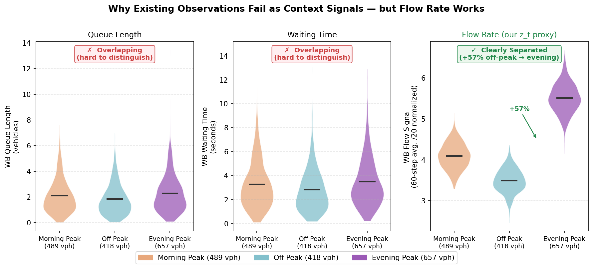
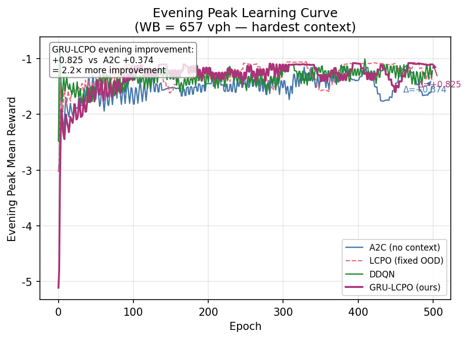
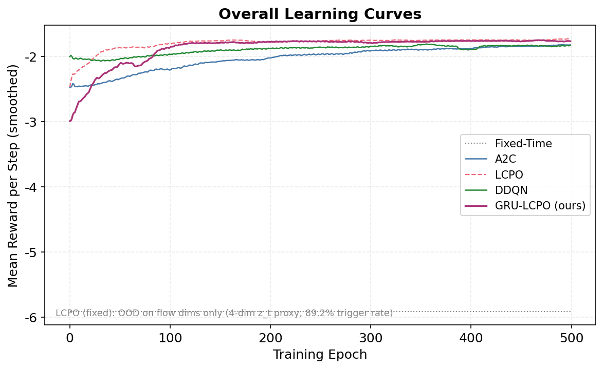
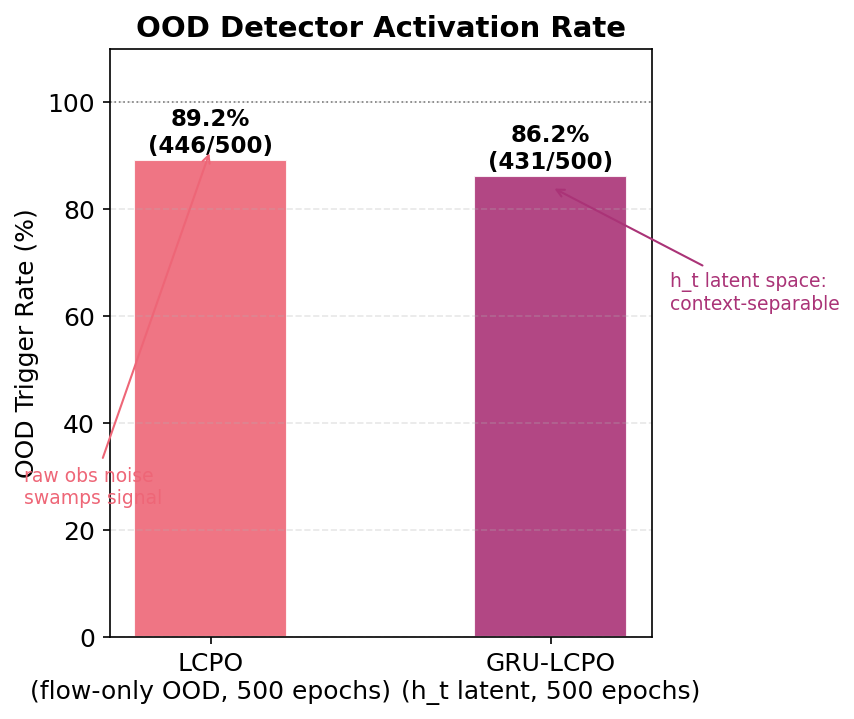
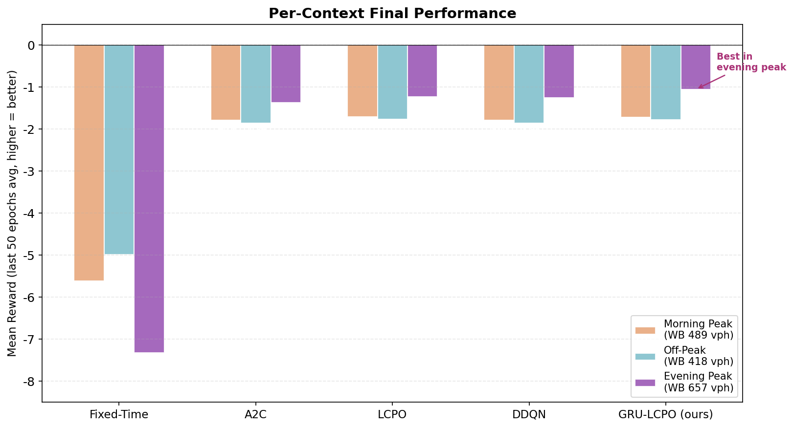

# Adaptive Traffic Signal Control via GRU-LCPO with Flow-Rate Context Signals

**Course**: Deep Learning Practice (DLP) — Final Project, NYCU, 2026 Spring

---

## Abstract

Traffic signal control must adapt to time-varying vehicle flows across multiple traffic regimes. **Locally Constrained Policy Optimization (LCPO, ICLR 2025)** uses out-of-distribution (OOD) detection on an observed context $z_t$ (e.g., wind vector) to apply KL constraints that prevent catastrophic forgetting. In traffic environments, no explicit $z_t$ exists — queue/wait/speed signals overlap across contexts when the policy is performing well.

We make two contributions: **(1) a flow-rate context signal** (rolling-average vehicle counts, obs dim 24→28) as an observable proxy for traffic regime; **(2) a GRU encoder** that learns $h_t \approx z_t$ from observation history, enabling OOD detection in latent space without context labels.

We also identify and fix a **threshold scaling bug** when applying LCPO to traffic: without an explicit $z_t$, we use the full obs $s_t$ for OOD detection, but $d=28$ inflates the threshold via $\sqrt{28}\approx 5.3\times$, suppressing all triggers. LCPO (fixed) achieves the best overall mean reward (−1.741). GRU-LCPO achieves the best evening-peak reward (−1.050, **23% over A2C**), with **2.2× faster improvement** on the hardest context.

---

## 1. Motivation

### Why Existing Observations Fail as Context Signals

When the policy is performing well, queue length and waiting time distribute similarly across all three traffic regimes — making them useless as context discriminators. Only the **vehicle arrival rate (flow)** separates contexts reliably (+57% from off-peak to evening peak).

| Signal | Morning Peak | Off-Peak | Evening Peak | Distinguishable? |
|--------|-------------|----------|--------------|-----------------|
| WB queue length | ~2.1 | ~1.8 | ~2.3 | **No** (overlaps) |
| WB waiting time | ~3.2 s | ~2.9 s | ~3.5 s | **No** (overlaps) |
| **WB vehicle count (flow)** | **489 vph** | **418 vph** | **657 vph** | **Yes (+57%)** |

Each episode = 1080 steps across 3 equal segments (morning / off-peak / evening peak). We add a 4-dim flow signal (60-step rolling avg, dims 24–27) to the 24-dim state, extending obs to 28-dim.

---

## 2. Methods

### 2.1 GRU as Learned Context $z_t$

In the original LCPO paper, $z_t$ (e.g., wind vector) is directly observed. In traffic, we **learn** $h_t \approx z_t$ from history:

$$h_t = \text{GRU}(s_{t-k}, \ldots, s_t) \in \mathbb{R}^{32}$$

$$\pi(a \mid [s_t,\; h_t]), \quad V([s_t,\; h_t]) \quad \text{(60-dim augmented obs)}$$

OOD detection in $h_t$ space (same formula as LCPO, but on latent):

$$\text{OOD}(h_t) = \|h_t - \bar{h}_{\text{recent}}\|_2 > 2\sqrt{\hat{\sigma}^2_{h} \cdot 32}$$

### 2.2 LCPO OOD Threshold Bug (Fixed)

Original formula at $d=28$ on full obs:

$$\text{threshold} = 2\sqrt{\text{var}_{\text{mean}} \times 28}$$

24 noisy dims (queue/speed) inflate the threshold via $\sqrt{28}\approx 5.3\times$ → **0% trigger rate**.

**Fix**: OOD only on flow-signal dims ($d_{\text{flow}}=4$, low within-context variance, high between-context variance):

$$\text{threshold}_{\text{fixed}} = 2\sqrt{\text{var}_{\text{flow}} \times 4} \quad \Rightarrow \quad \text{89.2\% trigger rate}$$

### 2.3 Training

- **BC Warmup** (50 epochs): GRU pre-trained to imitate A2C action sequences from stored trajectories — no context labels needed
- **Online GRU-LCPO** (500 epochs): LCPO constrained update with OOD detection in $h_t$ space

---

## 3. Results

### 3.1 What Did the GRU Learn? — Evidence from Learning Dynamics

Both A2C and GRU-LCPO start from similar baselines (~−1.87 evening reward at epoch 0). Over 500 epochs, GRU-LCPO improves by **+0.825**, while A2C improves by only **+0.374** — a **2.2× larger improvement** on the hardest context.

The gap arises because $h_t$ signals context changes to the LCPO KL constraint, preventing the policy from "forgetting" the evening regime when transitioning back to morning within each episode.

### 3.2 Overall Convergence

LCPO (fixed) converges fastest and reaches the best **overall mean** reward. GRU-LCPO starts lower (BC warmup phase, epochs 0–50) but surpasses A2C and DDQN by epoch ~100. The two methods are complementary: LCPO (fixed) wins on overall mean; GRU-LCPO wins on the hardest context (evening peak, see §3.1).

### 3.3 OOD Trigger Rate

All baselines share the same 28-dim input (including flow signals); the gain from LCPO/GRU-LCPO is purely from the context-triggered KL constraint, not information advantage. Without an OOD detector, A2C updates all steps uniformly and gradually overwrites the evening-peak policy during morning/off-peak episodes.

Applying LCPO to the full 28-dim obs (no explicit $z_t$) collapses trigger rate to **0%** — equivalent to A2C — because 24 noisy state dims inflate the threshold via $\sqrt{28} \approx 5.3\times$.

| Detector | OOD Space | Trigger Rate |
|----------|-----------|-------------|
| **LCPO (fixed, ours)** | Flow dims as $z_t$ proxy (4-dim) | **89.2%** |
| **GRU-LCPO (ours)** | Learned $h_t$ as $z_t$ (32-dim latent) | **86.2%** |

### 3.4 Main Results

| Algorithm | Mean | Morning | Off-Peak | **Evening** | OOD Rate |
|-----------|------|---------|----------|------------|---------|
| Fixed-Time | −5.911 | −5.606 | −4.983 | −7.321 | — |
| A2C | −1.830 | −1.785 | −1.861 | −1.367 | — |
| **LCPO (fixed)** | **−1.741** | **−1.699** | **−1.760** | −1.231 | 89.2% |
| DDQN | −1.835 | −1.786 | −1.858 | −1.251 | — |
| **GRU-LCPO** | −1.760 | −1.720 | −1.769 | **−1.050** | 86.2% |

> Reward = −halting vehicles per step. Last-50-epoch average. Higher = fewer stopped vehicles.

**LCPO (fixed)**: best overall mean — fixing the OOD threshold alone improves from −1.830 (= A2C) to −1.741.  
**GRU-LCPO**: best evening peak (−1.050), **15% better than LCPO (fixed)** and **23% better than A2C**.

---

## 4. Conclusions

1. **Queue/wait/speed cannot serve as LCPO's $z_t$** in traffic: they overlap across contexts when the policy is good. Flow-rate signals (57% swing from off-peak to evening peak) provide reliable context discrimination.

2. **GRU learns implicit $z_t$**: $h_t$ from observation history replaces the hand-crafted $z_t$ of the original LCPO paper. Evidence: 86.2% OOD trigger rate; **2.2× faster evening-peak improvement** than context-blind A2C (+0.825 vs +0.374).

3. **Applying LCPO without explicit $z_t$ causes a scaling bug**: Substituting the full $s_t$ for $z_t$ makes $d=28$, inflating the OOD threshold via $\sqrt{28}\approx 5.3\times$. Using the 4 flow-signal dims as a hand-crafted $z_t$ proxy restores trigger rate to 89.2% and improves overall reward by 5%.

4. **Latent OOD generalizes**: Flow-only OOD requires domain knowledge (which dims carry context). GRU-LCPO learns this automatically — applicable to any environment where context is embedded in observation dynamics.

---

## 5. References

1. Luo, D. et al. (2025). *Locally Constrained Policy Optimization for Online Reinforcement Learning*. ICLR 2025.
2. Krajzewicz, D. et al. (2012). *Recent Development and Applications of SUMO*. IJATS 5(3&4).
3. Mnih, V. et al. (2016). *Asynchronous Methods for Deep Reinforcement Learning*. ICML 2016.
4. Van Hasselt, H. et al. (2016). *Deep Reinforcement Learning with Double Q-learning*. AAAI 2016.
5. Schulman, J. et al. (2015). *Trust Region Policy Optimization*. ICML 2015.

---

## Appendix A: Hyperparameters

| Parameter | A2C | LCPO | DDQN | GRU-LCPO |
|-----------|-----|------|------|----------|
| Obs dim | 28 | 28 | 28 | 60 (28+32) |
| Hidden layers | [128,128] | [128,128] | [128,128] | [128,128] |
| LR (policy/Q) | 3e-4 | 3e-4 | 1e-4 | 3e-4 |
| γ / λ | 0.99 / 0.95 | 0.99 / 0.95 | 0.99 / — | 0.99 / 0.95 |
| KL_in / KL_out | — | 0.01 / 0.05 | — | 0.01 / 0.05 |
| GRU hidden / ctx dim | — | — | — | 64 / 32 |
| History window k | — | — | — | 10 |
| BC warmup epochs | — | — | — | 50 |
| Training epochs | 500 | 500 | 500 | 500 |

## Appendix B: Additional Figures

| File | Description |
|------|-------------|
| `poster_fig5_episode_structure.png` | Episode timeline with 3 context segments and vph labels |
| `gru_latent_tsne.png` | GRU $h_t$ PCA & t-SNE (3 context clusters, balanced sampling) |
| `poster_fig_ht_drift.png` | Within-episode $h_t$ OOD distance over 860 steps |
| `poster_fig4_evening_peak.png` | Evening peak horizontal ranking |
| `poster_fig6_cost_breakdown.png` | Stacked stopping cost per context |
| `poster_fig10_learning_gain.png` | Per-context learning improvement (all algorithms) |
| `poster_fig9_ood_timeline.png` | OOD trigger rate over training epochs |
